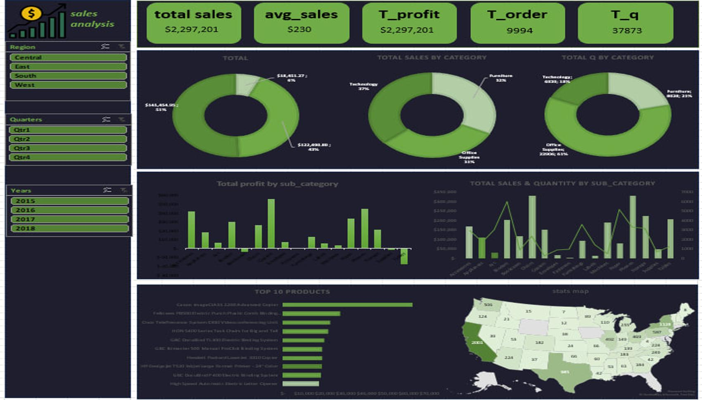

# 📊 Sales Performance Dashboard - Excel

## 📌 Project Overview
This dashboard was built using **Microsoft Excel** to provide a comprehensive view of sales performance across product categories, regions, and time periods. The dataset includes key metrics such as total profit, average sales, total orders, and quantity sold. The goal is to help decision-makers identify high-performing segments, monitor regional contributions, and optimize inventory and sales strategies.

## 🖥️ Dashboard Preview

## 🎯 Objectives
- Track overall sales KPIs including total profit, average sales, total orders, and total quantity.
- Analyze sales and quantity distribution by category and sub-category.
- Identify top-performing products and regions.
- Provide actionable insights for improving profitability and operational efficiency.

## 🛠️ Tools Used
- **Microsoft Excel** – Full dashboard development (Pivot Tables, Pivot Charts, Slicers, Formulas)

## 💡 Key Insights
- **Total Profit** reached **$2.3M**, with an average sales value of **$230**.
- The **West** region accounts for **57%** of total sales, indicating a strong market presence.
- The **Retail** sector drives **67%** of total sales, while **Technology** contributes **32%**.
- In terms of quantity, **Technology** leads with **62%**, suggesting a higher unit turnover in that category.
- **Profit distribution** is nearly balanced between Technology (51%) and Retail (49%), highlighting both categories as key profit drivers.
- **Samsung Galaxy S20 Ultra** tops the list of 10 best-selling products with **55%**, followed by several iPhone models.

## 📋 Dashboard Features
### Key Performance Indicators (KPIs)
- Total Profit  
- Average Sales  
- Total Orders  
- Total Quantity

### Filters & Interactivity
- Interactive **Slicers** to filter data by:
  - Category
  - Sub-Category
  - Region
  - Quarter

### Visualizations
- **Bar charts** for sales distribution by region and category
- **Pie charts** for profit and quantity distribution
- **Horizontal bar charts** for top products
- **Map** for sales distribution by country

